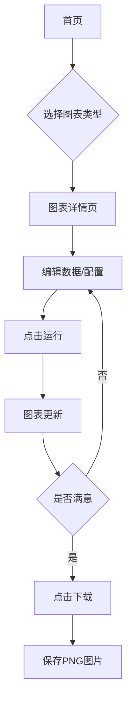

## 1. 产品概述
一个基于React和shadcn-ui的ECharts Demo封装展示网站，将ECharts官方所有图表Demo进行可视化封装。用户可以通过左侧数据输入区域自定义图表数据，右侧实时预览图表效果，并支持图表下载功能。

目标用户：数据可视化开发者、图表设计师、需要快速生成图表的用户。

## 2. 核心功能

### 2.1 用户角色
| 角色 | 注册方式 | 核心权限 |
|------|----------|----------|
| 访客用户 | 无需注册 | 浏览图表、编辑数据、下载图表 |

### 2.2 功能模块
网站主要包含以下页面：
1. **首页**：图表类型展示画廊，包含所有ECharts图表类型的缩略图和简介。
2. **图表详情页**：分屏布局，左侧为数据输入区域，右侧为图表预览区域。

### 2.3 页面详情
| 页面名称 | 模块名称 | 功能描述 |
|----------|----------|----------|
| 首页 | 图表画廊 | 展示所有ECharts图表类型，每个图表显示缩略图、标题和简短描述 |
| 首页 | 搜索筛选 | 支持按图表类型（柱状图、折线图、饼图等）进行筛选 |
| 图表详情页 | 数据输入区 | 左侧JSON编辑器，提供默认模拟数据，用户可编辑图表数据和配置 |
| 图表详情页 | 图表预览区 | 右侧实时渲染图表，支持缩放、拖拽等交互功能 |
| 图表详情页 | 操作按钮 | 包含"运行"按钮更新图表，"下载"按钮保存图表为PNG图片 |
| 图表详情页 | 图表配置 | 提供图表主题、颜色、标题等基础配置选项 |

## 3. 核心流程
用户操作流程：
1. 访客进入首页浏览图表类型
2. 点击感兴趣的图表进入详情页
3. 在左侧编辑数据或配置
4. 点击"运行"按钮更新右侧图表
5. 满意后点击"下载"保存图表

## 4. 用户界面设计

### 4.1 设计风格
- **主色调**：蓝色系（#1890ff）为主，灰色系为辅
- **按钮样式**：圆角矩形，悬停效果明显
- **字体**：系统默认字体，标题16px，正文14px
- **布局风格**：卡片式布局，响应式网格系统
- **图标风格**：使用Lucide React图标库，线条简洁风格

### 4.2 页面设计概览
| 页面名称 | 模块名称 | UI元素 |
|----------|----------|--------|
| 首页 | 图表画廊 | 网格布局展示图表卡片，每张卡片包含图表缩略图、标题、描述文字，卡片悬停时有阴影效果 |
| 图表详情页 | 数据输入区 | 左侧固定宽度面板，包含JSON代码编辑器（Monaco Editor），语法高亮，错误提示 |
| 图表详情页 | 图表预览区 | 右侧自适应区域，图表居中显示，背景白色，边框圆角，提供全屏查看选项 |
| 图表详情页 | 操作栏 | 顶部工具栏包含运行按钮（蓝色主按钮）、下载按钮（绿色按钮）、配置选项下拉菜单 |

### 4.3 响应式设计
- 桌面端优先设计，支持1200px以上最佳显示
- 平板端自适应，图表画廊变为2列布局
- 移动端适配，详情页变为上下布局，数据输入区在上，图表预览区在下

### 4.4 交互细节
- 图表卡片悬停时显示"查看详情"按钮
- 数据编辑器支持语法检查和自动格式化
- 图表渲染时有加载动画
- 下载完成后显示成功提示