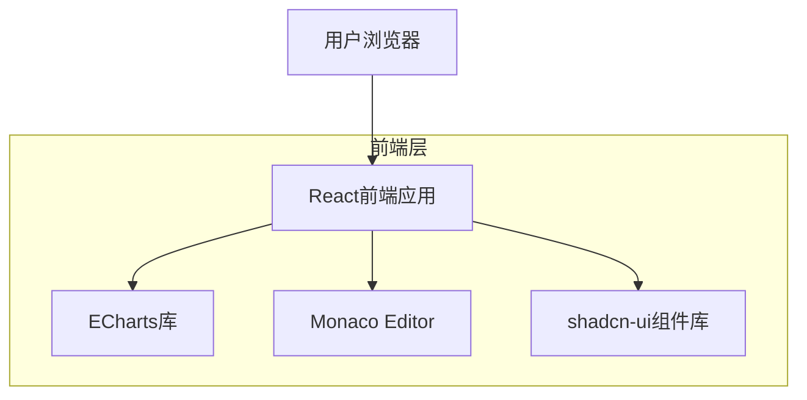
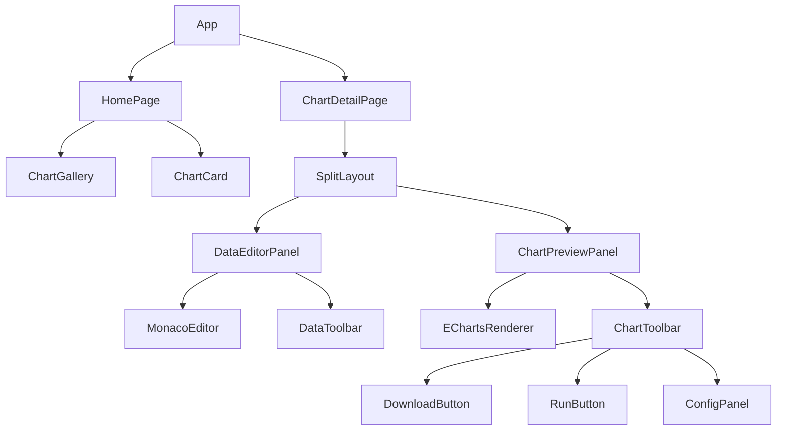

## 1. 架构设计



## 2. 技术栈描述

- **前端**: React@18 + TypeScript + Vite
- **初始化工具**: vite-init
- **UI框架**: shadcn-ui + Tailwind CSS
- **图表库**: ECharts@5
- **代码编辑器**: Monaco Editor
- **图标库**: Lucide React
- **后端**: 无（纯前端应用）

## 3. 路由定义

| 路由 | 用途 |
|------|------|
| / | 首页，图表类型画廊展示 |
| /chart/:type | 图表详情页，根据图表类型显示对应的编辑器 |
| /chart/bar | 柱状图详情页 |
| /chart/line | 折线图详情页 |
| /chart/pie | 饼图详情页 |
| /chart/scatter | 散点图详情页 |

## 4. 组件架构

### 4.1 核心组件类型定义

```typescript
// 图表数据接口
interface ChartData {
  xAxis: string[]
  series: Array<{
    name: string
    data: number[]
    type: string
  }>
}

// 图表配置接口
interface ChartConfig {
  title: string
  subtitle?: string
  theme: 'default' | 'dark' | 'vintage'
  colors: string[]
  width: number
  height: number
}

// ECharts选项接口
interface EChartsOption {
  title: object
  tooltip: object
  legend: object
  xAxis: object
  yAxis: object
  series: object[]
  color: string[]
}
```

### 4.2 组件结构



## 5. 数据模型

### 5.1 图表模板数据

```typescript
// 图表模板接口
interface ChartTemplate {
  id: string
  type: 'bar' | 'line' | 'pie' | 'scatter'
  name: string
  description: string
  thumbnail: string
  defaultData: ChartData
  defaultConfig: ChartConfig
  echartsOption: EChartsOption
}

// 本地存储的图表数据
interface SavedChart {
  id: string
  type: string
  name: string
  data: ChartData
  config: ChartConfig
  createdAt: Date
  updatedAt: Date
}
```

### 5.2 默认图表数据示例

```typescript
// 柱状图默认数据
const barChartDefaultData: ChartData = {
  xAxis: ['Mon', 'Tue', 'Wed', 'Thu', 'Fri', 'Sat', 'Sun'],
  series: [{
    name: 'Sales',
    data: [120, 200, 150, 80, 70, 110, 130],
    type: 'bar'
  }]
}

// 折线图默认数据
const lineChartDefaultData: ChartData = {
  xAxis: ['Jan', 'Feb', 'Mar', 'Apr', 'May', 'Jun'],
  series: [
    {
      name: 'Email',
      data: [120, 132, 101, 134, 90, 230],
      type: 'line'
    },
    {
      name: 'Affiliate',
      data: [220, 182, 191, 234, 290, 330],
      type: 'line'
    }
  ]
}
```

## 6. 核心功能实现

### 6.1 图表渲染流程

```typescript
// 图表渲染组件
const EChartsRenderer: React.FC<{
  option: EChartsOption
  width?: number
  height?: number
}> = ({ option, width = 800, height = 600 }) => {
  const chartRef = useRef<HTMLDivElement>(null)
  const chartInstance = useRef<echarts.ECharts | null>(null)

  useEffect(() => {
    if (chartRef.current) {
      chartInstance.current = echarts.init(chartRef.current)
      chartInstance.current.setOption(option)
    }
    
    return () => {
      chartInstance.current?.dispose()
    }
  }, [])

  useEffect(() => {
    if (chartInstance.current) {
      chartInstance.current.setOption(option)
    }
  }, [option])

  return <div ref={chartRef} style={{ width, height }} />
}
```

### 6.2 图表下载功能

```typescript
// 图表下载函数
const downloadChart = (chartInstance: echarts.ECharts, filename: string) => {
  const url = chartInstance.getDataURL({
    type: 'png',
    pixelRatio: 2,
    backgroundColor: '#fff'
  })
  
  const link = document.createElement('a')
  link.download = `${filename}.png`
  link.href = url
  link.click()
}
```

### 6.3 数据验证

```typescript
// JSON数据验证
const validateChartData = (jsonString: string): boolean => {
  try {
    const data = JSON.parse(jsonString)
    // 验证数据结构
    return data && 
           Array.isArray(data.xAxis) && 
           Array.isArray(data.series) &&
           data.series.every((s: any) => 
             s.name && 
             Array.isArray(s.data) && 
             s.type
           )
  } catch {
    return false
  }
}
```

## 7. 状态管理

使用React Context进行状态管理：

```typescript
// 图表状态Context
interface ChartContextType {
  currentChart: ChartTemplate | null
  chartData: ChartData
  chartConfig: ChartConfig
  updateChartData: (data: ChartData) => void
  updateChartConfig: (config: ChartConfig) => void
}

const ChartContext = createContext<ChartContextType | null>(null)
```

## 8. 性能优化

- 使用React.memo优化组件重渲染
- Monaco Editor按需加载语言支持
- ECharts实例复用避免重复初始化
- 大数据量图表使用虚拟滚动
- 图片下载使用Canvas缓存优化