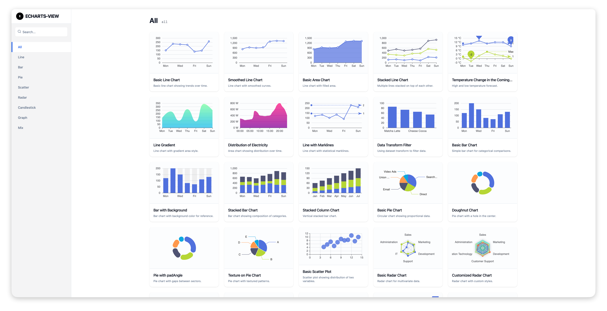
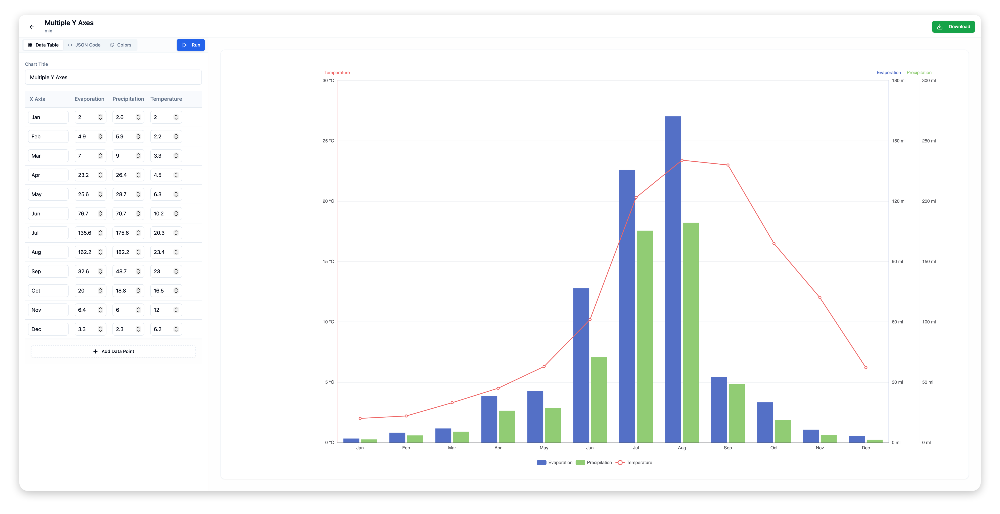
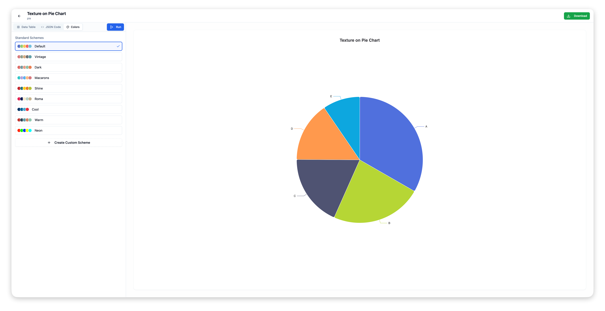

# Magic Charts

**Magic Charts** is a locally deployable E-Charts data panel designed for seamless data visualization. It allows users to import text-based data (via JSON code or a visual table editor), preview charts in real-time, and download the results as high-quality images.

Currently, the project supports a curated selection of chart types, including Line, Bar, Pie, Scatter, Radar, and Mixed charts, with more types being actively added.

## 📸 Screenshots

| Home Page | Chart Editing | Visual Data Editor |
|:---:|:---:|:---:|
|  |  |  |

## ✨ Features

*   **Local Deployment**: Runs entirely on your local machine for privacy and speed.
*   **Data Import & Editing**:
    *   **Visual Editor**: Input data using a spreadsheet-like interface.
    *   **Code Editor**: Paste or edit raw JSON for advanced configuration.
*   **Real-time Preview**: See your chart update instantly as you modify data or settings.
*   **Color Customization**: Apply professional color themes or create your own custom palettes.
*   **Image Export**: One-click download of charts as PNG images.
*   **Chart Gallery**: Browse various chart templates to start your visualization quickly.

## 🚀 Getting Started

1.  **Clone the repository**
    ```bash
    git clone https://github.com/yourusername/magic-charts.git
    cd magic-charts
    ```

2.  **Install dependencies**
    ```bash
    npm install
    ```

3.  **Start the application**
    ```bash
    npm run dev
    ```

4.  **Open in Browser**
    Visit `http://localhost:5173` to start creating charts.

## 📈 Supported Chart Types

*   **Line Charts**: Basic, Smoothed, Area, Stacked, Gradient, etc.
*   **Bar Charts**: Basic, Stacked, Background, Mixed, etc.
*   **Pie Charts**: Basic, Doughnut, Textured.
*   **Scatter Charts**: Basic Scatter Plot.
*   **Radar Charts**: Basic & Custom Radar.
*   **Others**: Candlestick, Graph, Mixed Combinations.

*(More chart types are in development)*

## 📄 License

MIT License
